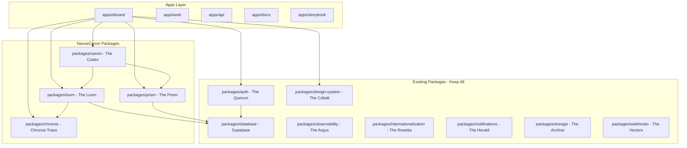

# NexusCanon Axis Implementation Plan

## Current State

- **Source:** next-forge v5.3.2 cloned to `C:\AI-BOS\axis`
- **Target:** NexusCanon Standard A (Titan) compliant monorepo
- **Compliance:** 70% out-of-box, 30% requires implementation

---

## Phase 1: Foundation Setup (The Atlas)

### 1.1 Repository Configuration

Update root configuration to reflect NexusCanon identity:

- [`C:\AI-BOS\axis\package.json`](C:\AI-BOS\axis\package.json): Update name to `axis-monorepo`
- [`C:\AI-BOS\axis\.cursorrules.example`](C:\AI-BOS\axis.cursorrules.example): Copy and adapt as `.cursorrules` with NexusCanon Constitution reference
- Keep all existing scripts and dependencies intact

### 1.2 NexusCanon Constitution as Cursor Rules

Create `.cursorrules` that references:

```yaml
---
description: NexusCanon Constitution - The Law
globs: "**/*"
alwaysApply: true
---
# Reference: C:\AI-BOS\eBOM\.cursor\NexusCanon_Constitution.md
```

---

## Phase 2: Database Migration - Neon to Supabase (The Loom)

### 2.1 Remove Neon Dependencies

From [`packages/database/package.json`](C:\AI-BOS\axis\packages\database\package.json):

```bash
pnpm remove @neondatabase/serverless @prisma/adapter-neon ws @types/ws --filter @repo/database
```

### 2.2 Add Supabase Dependencies

```bash
pnpm install -D supabase --filter @repo/database
```

### 2.3 Update Database Package

Update [`packages/database/index.ts`](C:\AI-BOS\axis\packages\database\index.ts):

```typescript
import "server-only";
import { PrismaClient } from "@prisma/client";

export const database = new PrismaClient();
export * from "@prisma/client";
```

### 2.4 Update Prisma Schema

Update [`packages/database/prisma/schema.prisma`](C:\AI-BOS\axis\packages\database\prisma\schema.prisma):

```prisma
datasource db {
  provider  = "postgresql"
  url       = env("DATABASE_URL")
  directUrl = env("DIRECT_URL")
}
```

### 2.5 Environment Variables

Add to `.env.local` in each app:

```bash
DATABASE_URL="postgres://...?pgbouncer=true&connection_limit=1"
DIRECT_URL="postgres://..."
NEXT_PUBLIC_SUPABASE_URL="https://your-project.supabase.co"
NEXT_PUBLIC_SUPABASE_ANON_KEY="your-anon-key"
```

---

## Phase 3: Authentication Migration - Clerk to Supabase Auth (The Quorum)

### 3.1 Remove Clerk Dependencies

```bash
pnpm remove @clerk/nextjs @clerk/themes @clerk/types --filter @repo/auth
```

### 3.2 Add Supabase Auth Dependencies

```bash
pnpm add @supabase/supabase-js @supabase/ssr --filter @repo/auth
```

### 3.3 Create Supabase Auth Clients

Update [`packages/auth/server.ts`](C:\AI-BOS\axis\packages\auth\server.ts) with Supabase server client and `currentUser()`, `auth()` helpers.

Update [`packages/auth/client.ts`](C:\AI-BOS\axis\packages\auth\client.ts) with Supabase browser client.

### 3.4 Organization Schema (Living Schema Pattern)

Add to Prisma schema for organization management:

```prisma
model Organization {
  id        String   @id @default(cuid())
  name      String
  members   OrganizationMember[]
  @@map("organizations")
}

model OrganizationMember {
  id             String   @id @default(cuid())
  userId         String
  organizationId String
  role           String   @default("member")
  organization   Organization @relation(...)
  @@map("organization_members")
}
```

### 3.5 Update Auth Components

Replace Clerk components in `packages/auth/components/` with Supabase equivalents.

---

## Phase 4: NexusCanon Packages Creation

### 4.1 The Codex Package (Living Schema)

Create `packages/canon/` structure:

```
packages/canon/
├── package.json
├── tsconfig.json
├── index.ts
├── rules/           # Business validation rules
│   └── index.ts
├── types/           # Shared TypeScript types
│   └── index.ts
├── manifest/        # Living Schema definitions
│   └── index.ts     # Dual-Metadata: Technical + Business mapping
└── i18n/            # The Rosetta integration
    └── index.ts
```

**Key Implementation - Dual-Metadata Pattern:**

```typescript
// packages/canon/manifest/index.ts
export interface DualMetadata<T> {
  technical: {
    type: string; // e.g., "decimal(10,2)"
    column: string; // e.g., "unit_price"
    nullable: boolean;
  };
  business: {
    concept: string; // e.g., "Wholesale Price"
    domain: string; // e.g., "Pricing"
    rules: string[]; // e.g., ["Price > 0", "Currency required"]
  };
}

export const manifest = {
  // Hot-swappable schema definitions
  // Maps Business Concepts to Technical Columns
};
```

### 4.2 The Loom Package (Write Domain)

Create `packages/loom/` structure:

```
packages/loom/
├── package.json
├── tsconfig.json
├── index.ts
├── schema/          # Prisma schema extensions
├── actions/         # Server Actions (Zod protected)
│   └── index.ts
└── transactions/    # ACID transaction helpers
    └── index.ts
```

**Key Implementation:**

```typescript
// packages/loom/transactions/index.ts
import { database } from "@repo/database";
import { trace } from "@repo/chronos";

export async function withTransaction<T>(
  operation: () => Promise<T>,
  context: ChronosContext
): Promise<T> {
  return database.$transaction(async (tx) => {
    const result = await operation();
    await trace(context); // 6W1H audit
    return result;
  });
}
```

### 4.3 The Prism Package (Read Domain)

Create `packages/prism/` structure:

```
packages/prism/
├── package.json
├── tsconfig.json
├── index.ts
└── dto/             # Optimized Read Objects
    └── index.ts
```

**Key Implementation:**

```typescript
// packages/prism/index.ts
// Read-only queries, materialized views, cached data
// Speed > Freshness (< 100ms target)
```

### 4.4 The Chronos Package (Audit Trail)

Create `packages/chronos/` structure:

```
packages/chronos/
├── package.json
├── tsconfig.json
├── index.ts
└── trace.ts         # 6W1H forensic signature
```

**Key Implementation - 6W1H Trace:**

```typescript
// packages/chronos/trace.ts
export interface ChronosTrace {
  who: string; // Actor (userId)
  what: string; // Action (CREATE, UPDATE, DELETE)
  when: Date; // Timestamp
  where: string; // Context (table, module)
  why: string; // Intent (reason for action)
  which: string[]; // Alternatives considered
  how: string; // Method (API, UI, System)
}

export async function trace(context: ChronosTrace): Promise<void> {
  // Immutable audit log
}
```

---

## Phase 5: BEASTMODE Gold Theme Transfer (The Cobalt)

### 5.1 Update Design System CSS

Replace [`packages/design-system/styles/globals.css`](C:\AI-BOS\axis\packages\design-system\styles\globals.css) color variables:

```css
:root {
  /* BEASTMODE Gold Palette */
  --void: oklch(0.07 0 0); /* #0a0a0b */
  --obsidian: oklch(0.11 0 0); /* #141416 */
  --obsidian-light: oklch(0.14 0 0); /* #1c1c1e */
  --charcoal: oklch(0.17 0 0); /* #252528 */

  --parchment: oklch(0.97 0.01 90); /* #f8f6f0 */
  --parchment-light: oklch(0.98 0.01 90); /* #faf9f5 */
  --parchment-dark: oklch(0.93 0.01 90); /* #ede9e0 */
  --ash: oklch(0.85 0.02 90); /* #d4cfc4 */

  --gold: oklch(0.73 0.11 85); /* #c9a961 */
  --gold-light: oklch(0.78 0.09 85); /* #d9c085 */
  --gold-hover: oklch(0.68 0.12 85); /* #b8964d */
  --gold-dark: oklch(0.65 0.1 85); /* #a8905a */
  --ember: oklch(0.58 0.1 70); /* #9d7a4a */

  /* Map to design-system tokens */
  --background: var(--obsidian);
  --foreground: var(--parchment);
  --primary: var(--gold);
  --primary-foreground: var(--void);
  /* ... remaining mappings */
}

.dark {
  /* Dark mode uses the same palette (dark-first design) */
}
```

### 5.2 Add Typography Fonts

Update [`packages/design-system/lib/fonts.ts`](C:\AI-BOS\axis\packages\design-system\lib\fonts.ts):

```typescript
import { Cormorant_Garamond, Inter, JetBrains_Mono } from "next/font/google";

export const cormorant = Cormorant_Garamond({
  subsets: ["latin"],
  weight: ["400", "700"],
  variable: "--font-heading",
});

export const jetbrains = JetBrains_Mono({
  subsets: ["latin"],
  weight: ["400", "500"],
  variable: "--font-mono",
});

export const inter = Inter({
  subsets: ["latin"],
  variable: "--font-sans",
});

export const fonts = cn(
  cormorant.variable,
  jetbrains.variable,
  inter.variable,
  "touch-manipulation font-sans antialiased"
);
```

### 5.3 Update CSS Theme Mappings

```css
@theme inline {
  --font-heading: var(--font-cormorant);
  --font-sans: var(--font-inter);
  --font-mono: var(--font-jetbrains);

  /* Motion Physics - Gravitational Time */
  --duration-hover: 1000ms;
  --duration-commit: 1618ms;
}
```

---

## Phase 6: eBOARD MVP Application

### 6.1 Create eBOARD App

Copy `apps/app` as template to create `apps/eboard`:

```
apps/eboard/
├── app/
│   ├── (authenticated)/
│   │   ├── board/           # BoardDialog feature
│   │   ├── oracle/          # Oracle What-If feature
│   │   └── thanos/          # Thanos Trace feature
│   └── (unauthenticated)/
├── package.json
└── ...
```

### 6.2 eBOARD Features (from PRD)

Based on [`C:\AI-BOS\eBOM\.cursor\PRD_eBoard_v3.md`](C:\AI-BOS\eBOM.cursor\PRD_eBoard_v3.md):

- **Thanos Trace:** Audit trail with 6W1H signature
- **BoardDialog:** Decision documentation interface
- **Oracle What-If:** Scenario planning with projections

---

## Architecture Diagram



---

## Implementation Order

1. **Phase 1:** Foundation Setup (30 min)
2. **Phase 2:** Database Migration (1 hour)
3. **Phase 3:** Auth Migration (2 hours)
4. **Phase 4:** NexusCanon Packages (3 hours)
5. **Phase 5:** Theme Transfer (1 hour)
6. **Phase 6:** eBOARD App Creation (ongoing)

---

## Key Principles (From Constitution)

- **Never Remove:** Keep all example apps as templates
- **Living Schema:** Dual-Metadata pattern (Technical + Business)
- **Chronos Trace:** Every mutation requires 6W1H signature
- **Prime Monad:** Single runtime, no internal network calls
- **The Quorum:** Security/Audit domain, not a separate app
- **Atomic Truth:** All mutations wrapped in transactions
