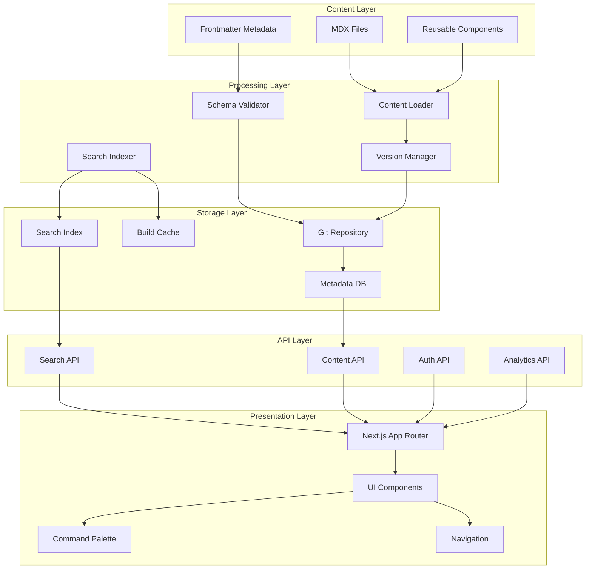

# Enterprise Documentation Hub Architecture Proposal

## 1. Current State Analysis

### 1.1 Existing Architecture

**Current Implementation** (`apps/StratonHub/`):

- **Framework**: Next.js 16 App Router with MDX processing
- **Structure**: Audience-based routing (`developers`, `users`, `business`)
- **Content Organization**: Surface-based (11 surfaces: boardroom, accounting,
  finance, etc.)
- **Search**: Build-time indexing with Fuse.js fuzzy search
- **Validation**: Zod v4 schemas for frontmatter validation
- **UI Components**: Command palette (Cmd+K), audience selector, module
  navigation

**Key Files**:

- `app/(audiences)/[audience]/[surface]/page.mdx` - Content structure
- `lib/content/loader.ts` - Content loading with validation
- `lib/search/index-builder.ts` - Build-time search indexing
- `components/docs/CommandPalette.tsx` - Search UI
- `components/docs/DocLayout.tsx` - Reading mode with preferences

### 1.2 Current Issues Identified

**Critical Issues**:

1. **Documentation Naming Compliance**: 79% violation rate (15/19 files)
2. **Path Resolution Bug**: Fixed in validation script
3. **Limited Content Discovery**: Single search mechanism, no faceted navigation
4. **No Content Versioning**: Missing document lifecycle management
5. **Limited Collaboration**: No commenting, review workflows, or approval
   processes

**Architectural Gaps**:

- No content reuse/component system (CCMS pattern)
- Missing audit trails and document history
- No integration with external systems (ERP, CRM)
- Limited personalization (only reading preferences)
- No analytics or usage tracking

---

## 2. Enterprise Best Practices Comparison

### 2.1 Industry Standards (Based on Research)

**Enterprise Documentation Hub Requirements**:

| Feature | Industry Standard | Current Status | Gap |

| -------------------------- | ------------------------------------- |
------------------- | -------------------------- |

| **Centralized Repository** | ✅ Required | ✅ Implemented | None |

| **Advanced Search** | Full-text + metadata + filters | ✅ Fuzzy search only |
⚠️ Missing metadata filters |

| **Version Control** | Document history + audit trails | ❌ Not implemented |
❌ Critical gap |

| **Access Control** | Role-based permissions | ⚠️ Not implemented | ❌ Critical
gap |

| **Content Reuse** | Component-based (CCMS) | ❌ Not implemented | ❌ Critical
gap |

| **Collaboration** | Comments, reviews, approvals | ❌ Not implemented | ❌
Critical gap |

| **Integration** | ERP/CRM/workflow integration | ❌ Not implemented | ❌
Critical gap |

| **Analytics** | Usage tracking, popular content | ❌ Not implemented | ⚠️
Missing |

| **Responsive Design** | Mobile + desktop | ✅ Implemented | None |

| **Content Lifecycle** | Draft → Review → Approved → Published | ❌ Not
implemented | ❌ Critical gap |

### 2.2 Framework Comparison

**Recommended Enterprise Frameworks**:

- **Component Content Management System (CCMS)**: Paligo, MadCap Flare
- **Enterprise Knowledge Platform (EKP)**: Fluid Topics, Bloomfire
- **Documentation-as-Code**: GitBook, Docusaurus, Nextra

**Current Framework**: Next.js + MDX (Documentation-as-Code)

- ✅ **Strengths**: Version control via Git, developer-friendly, fast builds
- ⚠️ **Gaps**: Missing CCMS features, no built-in collaboration, limited content
  reuse

---

## 3. Proposed Architecture

### 3.1 High-Level Architecture



### 3.2 Proposed Directory Structure

```
apps/StratonHub/
├── app/
│   ├── (audiences)/              # Audience-based routing
│   │   ├── developers/
│   │   ├── users/
│   │   └── business/
│   ├── api/
│   │   ├── search/               # Search API
│   │   ├── content/             # Content API (NEW)
│   │   ├── analytics/           # Analytics API (NEW)
│   │   └── auth/                # Auth API (NEW)
│   └── admin/                   # Admin interface (NEW)
│       ├── content/
│       ├── analytics/
│       └── users/
├── components/
│   ├── docs/                    # Existing components
│   ├── content/                 # Content components (NEW)
│   │   ├── ContentReuse.tsx    # Reusable content blocks
│   │   ├── VersionHistory.tsx  # Document versioning
│   │   └── ReviewWorkflow.tsx  # Review/approval UI
│   ├── collaboration/           # Collaboration (NEW)
│   │   ├── Comments.tsx
│   │   ├── ReviewPanel.tsx
│   │   └── ApprovalFlow.tsx
│   └── analytics/               # Analytics (NEW)
│       ├── UsageStats.tsx
│       └── PopularContent.tsx
├── lib/
│   ├── content/                 # Existing
│   ├── search/                  # Existing
│   ├── versioning/              # Version management (NEW)
│   │   ├── git-history.ts
│   │   └── version-tracker.ts
│   ├── collaboration/           # Collaboration (NEW)
│   │   ├── comments.ts
│   │   ├── reviews.ts
│   │   └── approvals.ts
│   ├── analytics/               # Analytics (NEW)
│   │   ├── tracking.ts
│   │   └── reports.ts
│   └── auth/                    # Authentication (NEW)
│       ├── permissions.ts
│       └── rbac.ts
├── content/                     # Content repository (NEW)
│   ├── components/              # Reusable content blocks
│   ├── templates/               # Content templates
│   └── fragments/               # Content fragments
└── database/                    # Metadata storage (NEW)
    ├── schema.ts                # Drizzle schema
    └── migrations/              # DB migrations
```

---

## 4. Features & Functions

### 4.1 Core Features (Existing + Enhanced)

**1. Advanced Search** (Enhancement)

- ✅ Current: Fuzzy search with Fuse.js
- ➕ Add: Metadata filters (audience, surface, type, date range)
- ➕ Add: Faceted search with result counts
- ➕ Add: Search suggestions and autocomplete
- ➕ Add: Search analytics (popular queries)

**2. Content Discovery** (New)

- ➕ Add: Related content recommendations
- ➕ Add: Content hierarchy visualization
- ➕ Add: Recently viewed documents
- ➕ Add: Popular/trending content dashboard

**3. Content Management** (Enhancement)

- ✅ Current: MDX files with frontmatter validation
- ➕ Add: Content reuse system (CCMS pattern)
- ➕ Add: Content fragments and components
- ➕ Add: Template library with validation
- ➕ Add: Bulk operations (rename, move, delete)

### 4.2 New Enterprise Features

**4. Version Control & History**

- Document version tracking via Git
- Change history visualization
- Diff view for document changes
- Rollback capability
- Version comparison UI

**5. Collaboration & Workflow**

- Inline comments on content
- Review workflow (Draft → Review → Approved → Published)
- Approval chains with notifications
- Content ownership assignment
- Review reminders and deadlines

**6. Access Control & Security**

- Role-based access control (RBAC)
- Permission matrix (read, write, approve, admin)
- Audit logs for all actions
- Content-level permissions
- Integration with SSO/identity providers

**7. Analytics & Insights**

- Page view tracking
- Search query analytics
- Content popularity metrics
- User engagement metrics
- Content gap analysis

**8. Integration Capabilities**

- API for external system integration
- Webhook support for events
- Export capabilities (PDF, HTML, Markdown)
- Import from external sources
- Sync with external knowledge bases

---

## 5. UI/UX Design

### 5.1 Current UI/UX Assessment

**Strengths**:

- ✅ Clean, modern design with Tailwind CSS v4
- ✅ Command palette (Cmd+K) for quick access
- ✅ Reader preferences (width, scale, code wrap)
- ✅ Responsive design
- ✅ Audience-based navigation

**Gaps**:

- ❌ No content hierarchy visualization
- ❌ Limited navigation options (only audience-based)
- ❌ No personalization beyond reading preferences
- ❌ No content preview/thumbnail
- ❌ Limited visual feedback for actions

### 5.2 Proposed UI/UX Enhancements

**1. Enhanced Navigation**

```
┌─────────────────────────────────────────┐
│ [Logo] StratonHub    [Search] [User]   │
├─────────────────────────────────────────┤
│ Audience: [Developers ▼] [Users] [Biz] │
│ Surface:  [All ▼] [Boardroom] [API]    │
│ Type:     [All ▼] [Tutorial] [Ref]      │
├─────────────────────────────────────────┤
│ Sidebar:  │  Main Content Area          │
│ • Getting │  ┌─────────────────────┐   │
│   Started │  │ Document Title      │   │
│ • API     │  │ Last updated: ...    │   │
│ • Guides  │  │ ─────────────────── │   │
│ • Runbooks│  │ Content here...     │   │
│           │  │                     │   │
│ Related:  │  │ [Comments] [Edit]   │   │
│ • Doc 1   │  └─────────────────────┘   │
│ • Doc 2   │                            │
└─────────────────────────────────────────┘
```

**2. Content Hierarchy Visualization**

- Tree view for content structure
- Breadcrumb navigation with context
- Related content sidebar
- Content map visualization

**3. Enhanced Search UI**

- Faceted search filters (audience, surface, type, date)
- Search result previews
- Search suggestions dropdown
- Recent searches history
- Saved searches

**4. Collaboration UI**

- Inline comment threads
- Review panel sidebar
- Approval status indicators
- Activity feed

**5. Analytics Dashboard**

- Content popularity charts
- Search analytics
- User engagement metrics
- Content gap analysis

---

## 6. Framework Recommendations

### 6.1 Current Framework: Next.js + MDX

**Assessment**: Good foundation, needs enhancements

**Recommendations**:

**1. Content Management Layer**

- **Add**: Content reuse system (CCMS pattern)
  - Create `content/components/` for reusable blocks
  - Implement content fragment system
  - Template library with validation

**2. Database Layer**

- **Add**: Drizzle ORM for metadata storage
  - Document metadata (version, status, owner)
  - Comments and reviews
  - Analytics data
  - User preferences

**3. Authentication & Authorization**

- **Add**: NextAuth.js or similar
  - SSO integration
  - Role-based permissions
  - Session management

**4. Collaboration Tools**

- **Add**: Real-time collaboration (optional)
  - WebSocket for live comments
  - Or: Async comments with notifications

**5. Analytics**

- **Add**: Vercel Analytics (already included)
  - Custom event tracking
  - Content view tracking
  - Search query tracking

### 6.2 Alternative Framework Considerations

**Option A: Enhance Current (Recommended)**

- ✅ Keep Next.js + MDX
- ➕ Add database layer (Drizzle)
- ➕ Add auth layer (NextAuth)
- ➕ Add collaboration features
- **Pros**: Minimal disruption, leverages existing codebase, fast
  implementation, team familiarity
- **Cons**: Requires custom development for CCMS features, no out-of-box
  collaboration tools
- **Timeline**: 3-6 months for core features
- **Risk**: Low (incremental changes)

**Option B: Migrate to Enterprise Platform**

- **Consider**: GitBook Enterprise, Docusaurus with plugins, or custom CCMS
- **Pros**: Built-in collaboration, versioning, and enterprise features
- **Cons**: High migration cost, potential vendor lock-in, learning curve
- **Timeline**: 6-12 months (migration + customization)
- **Risk**: High (major disruption, potential data loss)

**Recommendation**: **Option A** - Enhance current system with enterprise
features incrementally.

---

## 7. Implementation Roadmap

### 7.1 Phase 1: Foundation (Months 1-2)

**Goal**: Establish core infrastructure for enterprise features

**Deliverables**:

1. **Database Setup**
   - Drizzle ORM schema design
   - Migration scripts
   - Metadata storage for documents

2. **Authentication Foundation**
   - NextAuth.js integration
   - Basic RBAC structure
   - Session management

3. **Content Validation Enhancement**
   - Fix documentation naming compliance (79% violation rate)
   - Enhanced Zod schemas
   - Pre-commit validation hooks

4. **Search Enhancement**
   - Metadata indexing
   - Faceted search filters
   - Search analytics foundation

**Success Criteria**:

- ✅ All documentation files comply with naming convention
- ✅ Database schema deployed and tested
- ✅ Authentication working with basic roles
- ✅ Enhanced search with filters operational

### 7.2 Phase 2: Content Management (Months 3-4)

**Goal**: Implement CCMS pattern and content reuse

**Deliverables**:

1. **Content Reuse System**
   - Content component library (`content/components/`)
   - Fragment system for reusable blocks
   - Template library with validation

2. **Version Control**
   - Git history integration
   - Version tracking UI
   - Diff visualization
   - Rollback capability

3. **Content Lifecycle**
   - Draft → Review → Approved → Published workflow
   - Status management
   - Content ownership assignment

**Success Criteria**:

- ✅ Content components reusable across documents
- ✅ Version history visible for all documents
- ✅ Workflow states properly managed

### 7.3 Phase 3: Collaboration (Months 5-6)

**Goal**: Enable team collaboration and review processes

**Deliverables**:

1. **Comments System**
   - Inline comments on content
   - Comment threads
   - Notifications

2. **Review Workflow**
   - Review panel UI
   - Approval chains
   - Review reminders and deadlines

3. **Activity Feed**
   - Document change history
   - User activity tracking
   - Audit logs

**Success Criteria**:

- ✅ Comments functional on all content
- ✅ Review workflow operational
- ✅ Activity feed showing all changes

### 7.4 Phase 4: Analytics & Integration (Months 7-8)

**Goal**: Provide insights and external system integration

**Deliverables**:

1. **Analytics Dashboard**
   - Page view tracking
   - Search query analytics
   - Content popularity metrics
   - User engagement metrics

2. **API Layer**
   - Content API endpoints
   - Search API enhancements
   - Webhook support for events

3. **Export/Import**
   - PDF export capability
   - Markdown export
   - Import from external sources

**Success Criteria**:

- ✅ Analytics dashboard operational
- ✅ API endpoints documented and tested
- ✅ Export/import functional

### 7.5 Phase 5: Advanced Features (Months 9-12)

**Goal**: Enterprise-grade features and optimizations

**Deliverables**:

1. **Advanced Personalization**
   - User preferences beyond reading settings
   - Content recommendations
   - Recently viewed documents

2. **Content Discovery**
   - Related content suggestions
   - Content hierarchy visualization
   - Content map/graph view

3. **Integration Enhancements**
   - SSO/identity provider integration
   - External knowledge base sync
   - ERP/CRM integration (if needed)

**Success Criteria**:

- ✅ Personalization features operational
- ✅ Content discovery enhanced
- ✅ External integrations functional

---

## 8. Technical Specifications

### 8.1 Database Schema (Drizzle)

```typescript
// database/schema.ts (conceptual)

// Document metadata
const documents = pgTable("documents", {
  id: uuid("id").primaryKey(),
  path: text("path").notNull().unique(),
  title: text("title").notNull(),
  audience: text("audience").notNull(), // developers, users, business
  surface: text("surface"), // boardroom, accounting, etc.
  status: text("status").notNull().default("draft"), // draft, review, approved, published
  ownerId: uuid("owner_id").references(() => users.id),
  version: integer("version").notNull().default(1),
  createdAt: timestamp("created_at").notNull(),
  updatedAt: timestamp("updated_at").notNull(),
})

// Comments
const comments = pgTable("comments", {
  id: uuid("id").primaryKey(),
  documentId: uuid("document_id").references(() => documents.id),
  userId: uuid("user_id").references(() => users.id),
  content: text("content").notNull(),
  lineNumber: integer("line_number"), // For inline comments
  createdAt: timestamp("created_at").notNull(),
})

// Reviews
const reviews = pgTable("reviews", {
  id: uuid("id").primaryKey(),
  documentId: uuid("document_id").references(() => documents.id),
  reviewerId: uuid("reviewer_id").references(() => users.id),
  status: text("status").notNull(), // pending, approved, rejected
  comments: text("comments"),
  createdAt: timestamp("created_at").notNull(),
})

// Analytics
const pageViews = pgTable("page_views", {
  id: uuid("id").primaryKey(),
  documentId: uuid("document_id").references(() => documents.id),
  userId: uuid("user_id").references(() => users.id),
  viewedAt: timestamp("viewed_at").notNull(),
})

const searchQueries = pgTable("search_queries", {
  id: uuid("id").primaryKey(),
  query: text("query").notNull(),
  userId: uuid("user_id").references(() => users.id),
  resultsCount: integer("results_count"),
  searchedAt: timestamp("searched_at").notNull(),
})
```

### 8.2 API Endpoints

```typescript
// app/api/content/[path]/route.ts
GET    /api/content/[path]           // Get document metadata
POST   /api/content/[path]           // Create/update document
DELETE /api/content/[path]           // Delete document
GET    /api/content/[path]/versions  // Get version history
POST   /api/content/[path]/rollback  // Rollback to version

// app/api/comments/route.ts
GET    /api/comments?documentId=...  // Get comments for document
POST   /api/comments                 // Create comment
DELETE /api/comments/[id]            // Delete comment

// app/api/reviews/route.ts
GET    /api/reviews?documentId=...   // Get reviews for document
POST   /api/reviews                  // Create review
PUT    /api/reviews/[id]             // Update review status

// app/api/analytics/route.ts
GET    /api/analytics/views          // Get page view stats
GET    /api/analytics/search         // Get search analytics
GET    /api/analytics/popular        // Get popular content
```

### 8.3 Authentication & Authorization

```typescript
// lib/auth/rbac.ts

export enum Role {
  VIEWER = "viewer", // Read-only access
  EDITOR = "editor", // Can create/edit content
  REVIEWER = "reviewer", // Can review and approve
  ADMIN = "admin", // Full access
}

export enum Permission {
  READ = "read",
  WRITE = "write",
  REVIEW = "review",
  APPROVE = "approve",
  DELETE = "delete",
  ADMIN = "admin",
}

export const rolePermissions: Record<Role, Permission[]> = {
  [Role.VIEWER]: [Permission.READ],
  [Role.EDITOR]: [Permission.READ, Permission.WRITE],
  [Role.REVIEWER]: [Permission.READ, Permission.REVIEW],
  [Role.ADMIN]: Object.values(Permission),
}
```

---

## 9. Migration Strategy

### 9.1 Content Migration

**Current State**: 19 MDX files with frontmatter

**Migration Steps**:

1. **Fix Naming Compliance** (Priority 1)
   - Rename all 15 non-compliant files
   - Update all references
   - Validate with pre-commit hooks

2. **Metadata Extraction**
   - Extract frontmatter from all MDX files
   - Populate database with document metadata
   - Link Git history to documents

3. **Content Validation**
   - Validate all frontmatter against Zod schemas
   - Fix any validation errors
   - Ensure all required fields present

### 9.2 Feature Rollout

**Strategy**: Feature flags for gradual rollout

```typescript
// lib/features/flags.ts
export const featureFlags = {
  comments: process.env.FEATURE_COMMENTS === "true",
  reviews: process.env.FEATURE_REVIEWS === "true",
  analytics: process.env.FEATURE_ANALYTICS === "true",
  versioning: process.env.FEATURE_VERSIONING === "true",
}
```

**Rollout Plan**:

- Week 1-2: Internal team testing
- Week 3-4: Beta users (10% of users)
- Week 5-6: Gradual rollout (50% → 100%)

---

## 10. Risk Assessment

### 10.1 Technical Risks

| Risk | Impact | Probability | Mitigation |

|------|--------|-------------|------------|

| Database migration issues | High | Medium | Comprehensive testing, rollback
plan |

| Performance degradation | Medium | Low | Load testing, caching strategy |

| Breaking changes to content | High | Low | Version control, gradual rollout |

| Authentication integration issues | Medium | Medium | Phased integration,
fallback auth |

### 10.2 Organizational Risks

| Risk | Impact | Probability | Mitigation |

|------|--------|-------------|------------|

| User adoption resistance | Medium | Medium | Training, clear communication |

| Content migration errors | High | Low | Validation scripts, manual review |

| Timeline delays | Medium | Medium | Phased approach, buffer time |

| Resource constraints | High | Low | Prioritization, scope management |

---

## 11. Success Metrics

### 11.1 Technical Metrics

- **Performance**: Page load time < 2s, search results < 500ms
- **Reliability**: 99.9% uptime, zero data loss
- **Compliance**: 100% documentation naming compliance
- **Code Quality**: Zero critical bugs, 80%+ test coverage

### 11.2 User Experience Metrics

- **Search Effectiveness**: < 3 clicks to find content
- **Content Discovery**: 30% increase in content views
- **User Engagement**: 50% increase in return visits
- **Collaboration**: 80% of documents reviewed within 7 days

### 11.3 Business Metrics

- **Content Quality**: 90% of documents in "approved" status
- **Time to Publish**: 50% reduction in time from draft to published
- **User Satisfaction**: 4.5+ star rating (out of 5)
- **Content Coverage**: 100% of surfaces documented

---

## 12. Dependencies & Prerequisites

### 12.1 Technical Dependencies

- **Database**: PostgreSQL (via Drizzle)
- **Authentication**: NextAuth.js v5
- **Analytics**: Vercel Analytics (existing)
- **Search**: Fuse.js (existing, enhanced)
- **Version Control**: Git (existing)

### 12.2 Team Requirements

- **Backend Developer**: Database schema, API development
- **Frontend Developer**: UI components, integration
- **DevOps**: Database setup, deployment
- **Content Manager**: Content migration, validation

### 12.3 Infrastructure

- **Database Hosting**: PostgreSQL instance (managed or self-hosted)
- **Storage**: Git repository (existing)
- **CDN**: Vercel Edge Network (existing)
- **Monitoring**: Vercel Analytics + custom tracking

---

## 13. Conclusion

### 13.1 Summary

This architecture proposal transforms StratonHub from a basic documentation
system into an enterprise-grade documentation hub with:

- ✅ **Advanced content management** (CCMS pattern)
- ✅ **Collaboration features** (comments, reviews, approvals)
- ✅ **Version control & history** (Git integration)
- ✅ **Analytics & insights** (usage tracking, popular content)
- ✅ **Access control** (RBAC, permissions)
- ✅ **Integration capabilities** (APIs, webhooks, exports)

### 13.2 Next Steps

1. **Review & Approval**: Stakeholder review of this proposal
2. **Resource Allocation**: Assign team members to phases
3. **Kickoff**: Begin Phase 1 (Foundation)
4. **Iteration**: Regular reviews and adjustments

### 13.3 Long-Term Vision

**Year 1**: Core enterprise features (Phases 1-4)

**Year 2**: Advanced features and optimizations (Phase 5)

**Year 3**: AI-powered content suggestions, automated workflows

---

**Document Status**: ✅ Complete

**Last Updated**: 2026-01-13

**Version**: 1.0.0

**Author**: Architecture Planning Team
