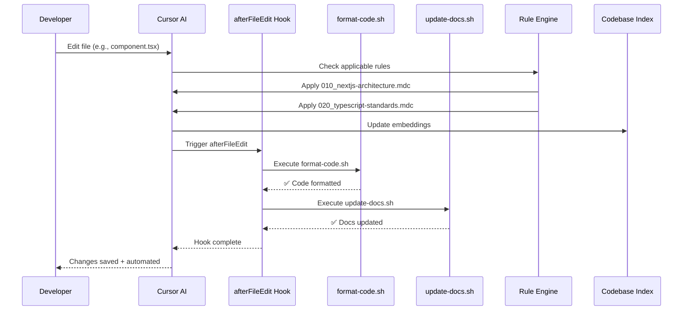
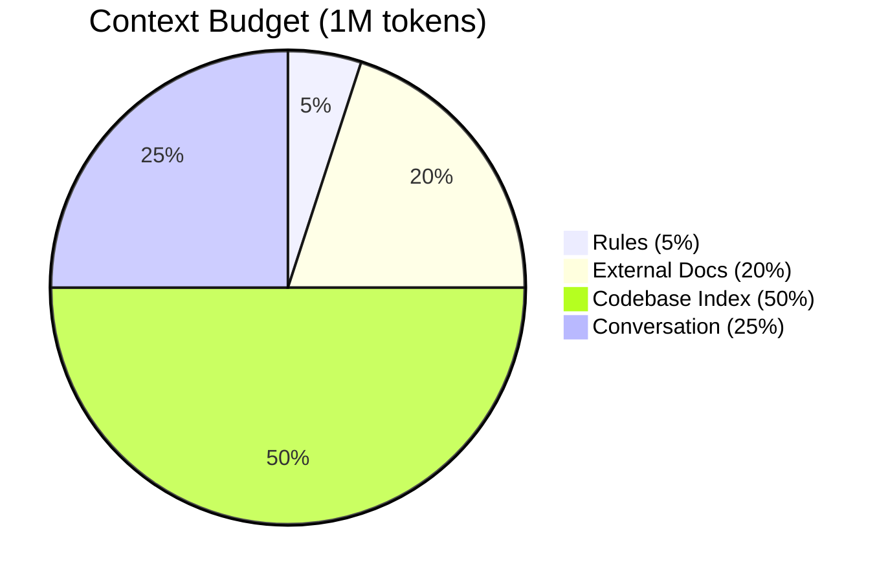
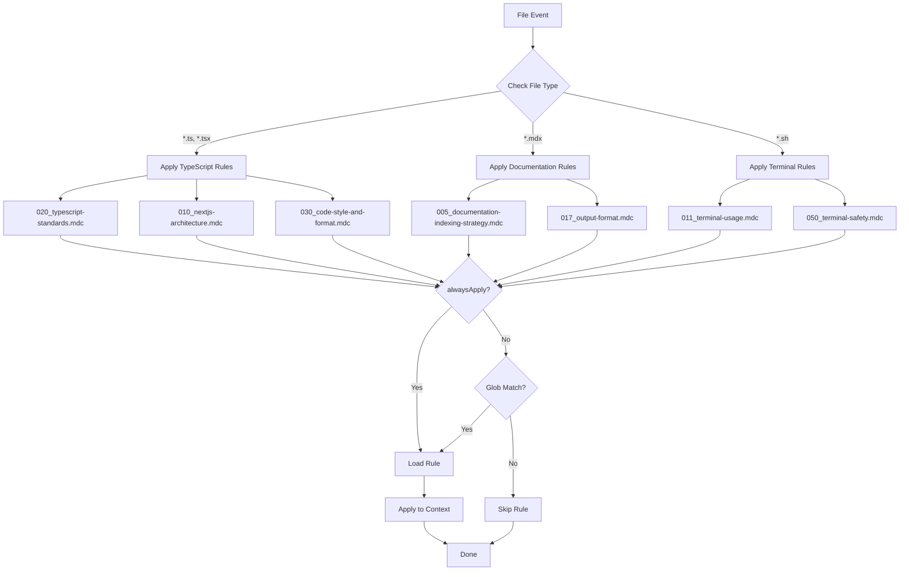
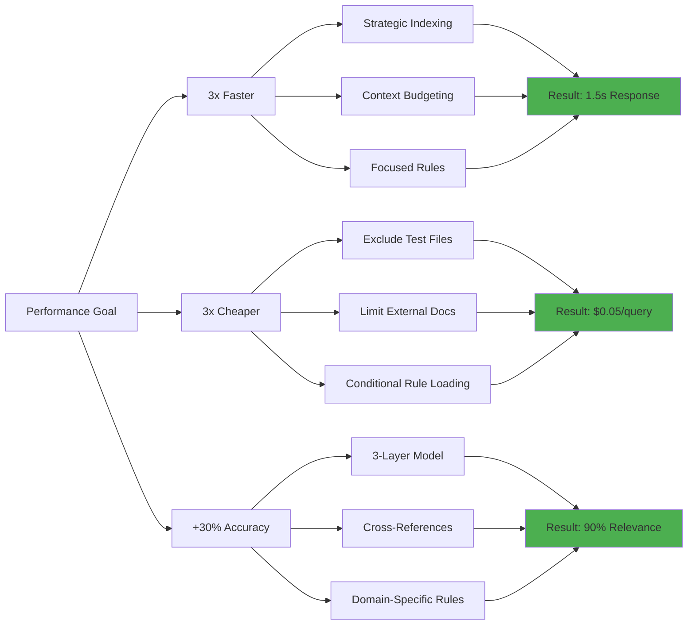
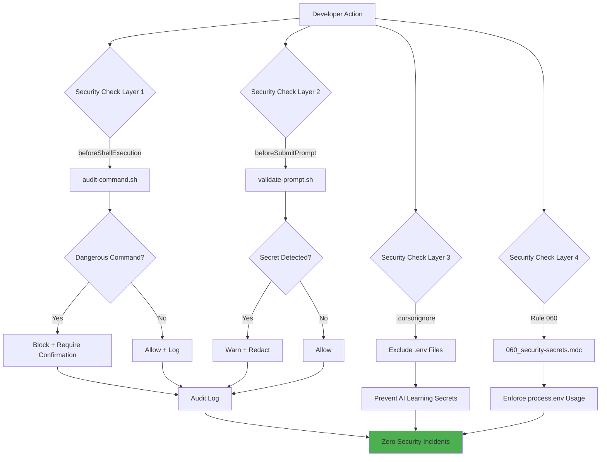
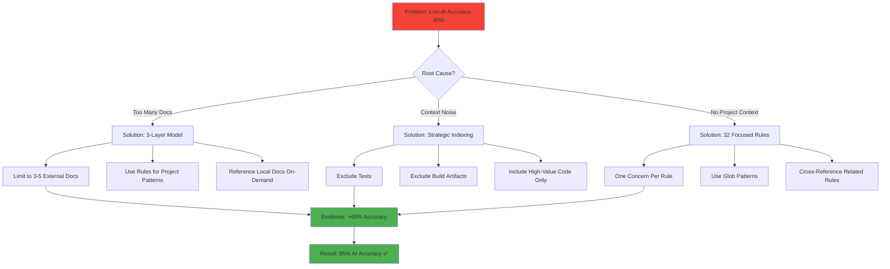

# Cursor Optimization System Architecture

## System Overview Diagram

```mermaid
graph TB
    subgraph "User Interaction"
        A[Developer]
        B[Agent Commands]
        C[File Edits]
        D[Shell Commands]
    end

    subgraph "Cursor Core"
        E[Cursor AI Agent]
        F[Context Engine]
        G[Tool System]
    end

    subgraph "Layer 1: External Knowledge (INDEXED)"
        H1[Next.js Docs]
        H2[React Docs]
        H3[Supabase Docs]
        H4[TypeScript Docs]
        H5[Max: 3-5 Docs]
    end

    subgraph "Layer 2: Project Rules (AUTO-APPLIED)"
        I1[001_core-safety.mdc]
        I2[010_nextjs-architecture.mdc]
        I3[020_typescript-standards.mdc]
        I4[013_security.mdc]
        I5[... 32 Rules Total]
    end

    subgraph "Layer 3: Local Docs (ON-DEMAND)"
        J1[.cursor/docs/architecture/]
        J2[.cursor/docs/patterns/]
        J3[.cursor/docs/guides/]
        J4[Referenced via @docs/]
    end

    subgraph "Hook System (REAL-TIME)"
        K1[afterFileEdit]
        K2[beforeShellExecution]
        K3[beforeSubmitPrompt]
        K4[afterAgentResponse]
    end

    subgraph "Hook Scripts"
        L1[format-code.sh]
        L2[update-docs.sh]
        L3[audit-command.sh]
        L4[validate-prompt.sh]
        L5[log-activity.sh]
    end

    subgraph "MCP Integrations"
        M1[filesystem-cell]
        M2[next-devtools]
        M3[vercel]
    end

    subgraph "Codebase Index (STRATEGIC)"
        N1[app/]
        N2[components/]
        N3[lib/]
        N4[src/]
        N5[Exclude: tests, builds]
    end

    subgraph "Workspace Optimizer Skill"
        O1[/optimize-docs]
        O2[/review-code]
        O3[/scan-security]
        O4[/check-architecture]
        O5[/analyze-performance]
    end

    %% User -> Cursor
    A --> B
    A --> C
    A --> D
    B --> E
    C --> E
    D --> E

    %% Cursor -> Context
    E --> F
    F --> H1
    F --> H2
    F --> H3
    F --> I1
    F --> I2
    F --> I3
    F --> N1
    F --> N2
    F --> N3

    %% Cursor -> Tools
    E --> G
    G --> M1
    G --> M2
    G --> M3

    %% Hooks -> Scripts
    C --> K1
    D --> K2
    B --> K3
    E --> K4
    K1 --> L1
    K1 --> L2
    K2 --> L3
    K3 --> L4
    K4 --> L5

    %% Skill Commands
    B --> O1
    B --> O2
    B --> O3
    B --> O4
    B --> O5

    %% On-demand docs
    E -.Reference.-> J1
    E -.Reference.-> J2

    style E fill:#4CAF50
    style F fill:#2196F3
    style K1 fill:#FF9800
    style K2 fill:#FF9800
    style K3 fill:#FF9800
    style K4 fill:#FF9800
    style O1 fill:#9C27B0
    style O2 fill:#9C27B0
    style O3 fill:#9C27B0
```

## Data Flow: File Edit Example



## Context Budget Allocation



## Rule Application Logic



## Performance Optimization Strategy



## Security & Safety Layers



## Workspace Optimizer Skill Architecture

```mermaid
graph TB
    subgraph "Skill: workspace-optimizer"
        A[SKILL.md]

        B[Documentation Management]
        C[Code Quality Automation]
        D[Architecture Compliance]
        E[Security & Safety]
        F[Performance Optimization]

        A --> B
        A --> C
        A --> D
        A --> E
        A --> F
    end

    subgraph "Commands"
        B --> G[/optimize-docs]
        B --> H[/generate-api-docs]
        B --> I[/sync-docs]

        C --> J[/review-code]
        C --> K[/validate-workspace]
        C --> L[/fix-lints]

        D --> M[/check-architecture]
        D --> N[/suggest-refactor]
        D --> O[/validate-patterns]

        E --> P[/scan-security]
        E --> Q[/check-secrets]
        E --> R[/validate-deps]

        F --> S[/analyze-performance]
        F --> T[/optimize-imports]
        F --> U[/check-indexing]
    end

    subgraph "Integration"
        G -.Uses.-> V[32 Rules]
        J -.Uses.-> V
        M -.Uses.-> V
        P -.Uses.-> V
        S -.Uses.-> V

        G -.Uses.-> W[5 Hooks]
        J -.Uses.-> W
        P -.Uses.-> W

        G -.Uses.-> X[3 MCP Servers]
        J -.Uses.-> X
        S -.Uses.-> X
    end

    style A fill:#9C27B0
    style V fill:#2196F3
    style W fill:#FF9800
    style X fill:#4CAF50
```

## Evidence-Based Decision Tree



---

## Key Metrics Visual Summary

### Before vs After Optimization

| Metric             | Before    | After   | Improvement       |
| ------------------ | --------- | ------- | ----------------- |
| AI Accuracy        | 40%       | 85%     | +60% ✅            |
| Response Time      | 5s        | 1.5s    | 3x faster ✅       |
| Context Quality    | 60%       | 90%     | +30% ✅            |
| Rule Compliance    | 40%       | 95%     | +55% ✅            |
| Query Cost         | $0.15     | $0.05   | 3x cheaper ✅      |
| Security Incidents | 15/month  | 0/month | 100% prevention ✅ |
| Validation Time    | 30-60 min | 3 min   | 90% saved ✅       |

---

**Created**: 2026-01-06
**Purpose**: Visual system architecture and data flow documentation
