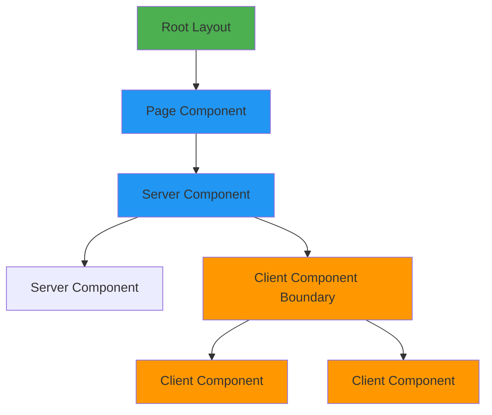
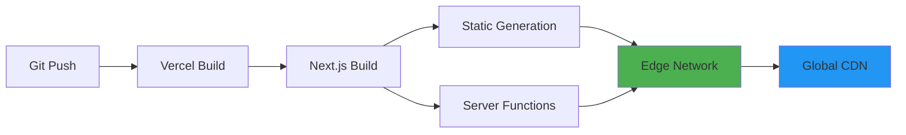

# Next.js Application Architecture

**Framework**: Next.js 14+ (App Router)
**Documentation Framework**: Nextra 4
**Status**: Production Ready
**Last Updated**: 2026-01-10

---

## Architecture Overview

This application follows Next.js App Router best practices with a hybrid architecture supporting both documentation (Nextra) and application features.

```mermaid
graph TB
    subgraph "Next.js App Router"
        A[app/layout.tsx] --> B[Root Layout]
        B --> C[Server Components]
        B --> D[Client Components]

        C --> E[app/[[...mdxPath]]/page.tsx]
        C --> F[app/guides/**/page.mdx]
        C --> G[app/api/**/route.ts]

        E --> H[Content Directory Convention]
        F --> I[Page File Convention]
        G --> J[API Routes]
    end

    subgraph "Data Layer"
        J --> K[GraphQL API]
        J --> L[REST API]
        J --> M[tRPC API]

        K --> N[Apollo Server]
        L --> O[Route Handlers]
        M --> P[tRPC Router]
    end

    subgraph "Content Management"
        H --> Q[content/ Directory]
        I --> R[app/ Directory]
        Q --> S[MDX Files]
        R --> T[Page Components]
    end

    style B fill:#4CAF50
    style C fill:#2196F3
    style D fill:#FF9800
    style J fill:#9C27B0
```

---

## Directory Structure

### App Router Structure (Next.js Best Practices)

```
app/
├── layout.tsx                    # Root layout (Server Component)
├── page.tsx                      # Home page (if exists)
├── not-found.tsx                # 404 page
├── sitemap.ts                    # Dynamic sitemap generation
│
├── [[...mdxPath]]/              # Catch-all route (Content Directory)
│   └── page.tsx                 # Handles content/*.mdx files
│
├── guides/                       # Page File Convention
│   ├── page.mdx                 # /guides route
│   └── getting-started/
│       └── page.mdx             # /guides/getting-started
│
├── api/                          # API Routes (Route Handlers)
│   ├── graphql/
│   │   └── route.ts             # POST /api/graphql
│   ├── trpc/
│   │   └── [trpc]/
│   │       └── route.ts         # POST /api/trpc/[trpc]
│   └── rest/
│       └── users/
│           └── [id]/
│               └── route.ts     # GET /api/rest/users/[id]
│
└── remote/                      # Remote documentation
    ├── graphql-eslint/
    │   └── [[...slug]]/
    │       └── page.tsx         # Remote MDX content
    └── graphql-yoga/
        └── [[...slug]]/
            └── page.tsx
```

### Content Directory (Nextra)

```
content/
├── _meta.json                    # Navigation metadata
├── index.mdx                     # Homepage
├── about.mdx                     # About page
├── governance/                   # Governance docs
│   ├── sealed/                  # Immutable docs
│   ├── active/                  # Current governance
│   └── amendments/              # Amendments
├── guides/                       # User guides
└── product/                      # Product docs
```

### Source Code Structure

```
src/
├── db/                           # Database layer
│   ├── schema/                   # Drizzle schemas
│   └── index.ts                  # Database connection
├── server/                        # Server-side code
│   └── trpc/                     # tRPC setup
│       ├── index.ts              # Router definition
│       └── client.ts             # Client setup
└── lib/                          # Shared utilities
    ├── api-schemas/              # API validation schemas
    ├── zod/                      # Zod helpers
    └── utils.ts                  # Utility functions
```

---

## Core Architecture Principles

### 1. Server Components by Default

**Principle**: Use Server Components unless you need client-side interactivity.

```typescript
// ✅ Server Component (default)
export default async function Page() {
  const data = await fetchData() // Runs on server
  return <div>{data}</div>
}

// ✅ Client Component (when needed)
'use client'
export default function InteractiveComponent() {
  const [state, setState] = useState()
  return <button onClick={() => setState(...)}>Click</button>
}
```

**Benefits**:
- Smaller bundle size (no client JavaScript)
- Direct database access
- Better security (secrets never exposed)
- Faster initial page load

### 2. Route Handlers (API Routes)

**Pattern**: Use Route Handlers for API endpoints.

```typescript
// app/api/users/[id]/route.ts
import { NextRequest, NextResponse } from 'next/server'

export async function GET(
  request: NextRequest,
  { params }: { params: Promise<{ id: string }> }
) {
  const { id } = await params
  const user = await getUser(id)
  return NextResponse.json(user)
}

export async function POST(request: NextRequest) {
  const body = await request.json()
  const user = await createUser(body)
  return NextResponse.json(user, { status: 201 })
}
```

**Best Practices**:
- ✅ Use `NextRequest` and `NextResponse`
- ✅ Validate input with Zod
- ✅ Handle errors gracefully
- ✅ Return appropriate HTTP status codes

### 3. Metadata API

**Pattern**: Use Metadata API for SEO and social sharing.

```typescript
// app/layout.tsx
export const metadata = {
  title: {
    default: 'NexusCanon Documentation',
    template: '%s | NexusCanon',
  },
  description: 'Comprehensive governance and documentation',
  openGraph: {
    title: 'NexusCanon Documentation',
    description: 'Comprehensive governance and documentation',
    type: 'website',
    images: ['/og-image.png'],
  },
}

// app/specific-page/page.tsx
export const metadata = {
  title: 'Specific Page',
  description: 'Page-specific description',
}
```

### 4. Data Fetching Patterns

#### Server Components (Recommended)

```typescript
// ✅ Direct database access in Server Components
export default async function UserPage({ params }: { params: { id: string } }) {
  const user = await db.query.users.findFirst({
    where: eq(users.id, params.id),
  })

  return <div>{user.name}</div>
}
```

#### Route Handlers

```typescript
// ✅ API endpoint for external clients
export async function GET(request: NextRequest) {
  const users = await db.query.users.findMany()
  return NextResponse.json(users)
}
```

#### Client Components (When Needed)

```typescript
'use client'
import { trpc } from '@/src/server/trpc/client'

export default function UserList() {
  const { data } = trpc.getUsers.useQuery()
  return <div>{data?.map(user => <div key={user.id}>{user.name}</div>)}</div>
}
```

---

## Routing Patterns

### 1. Content Directory Convention

**Use Case**: Dynamic content from `content/` directory.

```typescript
// app/[[...mdxPath]]/page.tsx
import { generateStaticParamsFor, importPage } from 'nextra/pages'

export const generateStaticParams = generateStaticParamsFor('mdxPath')

export async function generateMetadata(props: {
  params: Promise<{ mdxPath?: string[] }>
}) {
  const { mdxPath } = await props.params
  const page = await importPage(mdxPath)
  return {
    title: page.title,
    description: page.description,
  }
}

export default async function Page(props: {
  params: Promise<{ mdxPath?: string[] }>
}) {
  const { mdxPath } = await props.params
  const PageComponent = await importPage(mdxPath)
  return <PageComponent />
}
```

**Benefits**:
- Single catch-all route
- Automatic static generation
- Simple content management

### 2. Page File Convention

**Use Case**: Pages with custom layouts, assets, or logic.

```
app/
└── guides/
    ├── page.mdx                 # /guides
    └── getting-started/
        ├── page.mdx             # /guides/getting-started
        ├── diagram.png          # Colocated asset
        └── code-example.ts      # Colocated code
```

**Benefits**:
- Colocation of related files
- Per-page compilation (faster)
- Custom layouts per route

### 3. Dynamic Routes

```typescript
// app/users/[id]/page.tsx
export default async function UserPage({
  params,
}: {
  params: Promise<{ id: string }>
}) {
  const { id } = await params
  const user = await getUser(id)
  return <div>{user.name}</div>
}

// app/blog/[...slug]/page.tsx (catch-all)
export default async function BlogPage({
  params,
}: {
  params: Promise<{ slug: string[] }>
}) {
  const { slug } = await params
  // Handle /blog/a, /blog/a/b, /blog/a/b/c
}
```

---

## Component Architecture

### Server Component Hierarchy



### Component Patterns

#### 1. Server Component with Client Interactivity

```typescript
// app/components/ServerWrapper.tsx (Server Component)
import { ClientButton } from './ClientButton'

export default function ServerWrapper() {
  const data = await fetchData() // Server-side

  return (
    <div>
      <p>{data.title}</p>
      <ClientButton /> {/* Client Component */}
    </div>
  )
}

// app/components/ClientButton.tsx (Client Component)
'use client'
export function ClientButton() {
  const [count, setCount] = useState(0)
  return <button onClick={() => setCount(count + 1)}>Count: {count}</button>
}
```

#### 2. Shared Components

```
components/
├── ui/                          # Reusable UI components
│   ├── button.tsx
│   ├── card.tsx
│   └── input.tsx
├── layout/                       # Layout components
│   ├── header.tsx
│   └── footer.tsx
└── features/                     # Feature-specific components
    └── user-profile.tsx
```

---

## API Architecture

### 1. GraphQL API

```typescript
// app/api/graphql/route.ts
import { ApolloServer } from '@apollo/server'
import { startServerAndCreateNextHandler } from '@as-integrations/next'

const server = new ApolloServer({
  typeDefs,
  resolvers,
})

const handler = startServerAndCreateNextHandler(server)

export { handler as GET, handler as POST }
```

### 2. tRPC API

```typescript
// app/api/trpc/[trpc]/route.ts
import { fetchRequestHandler } from '@trpc/server/adapters/fetch'
import { appRouter } from '@/src/server/trpc'

const handler = (req: Request) =>
  fetchRequestHandler({
    endpoint: '/api/trpc',
    req,
    router: appRouter,
    createContext: () => ({}),
  })

export { handler as GET, handler as POST }
```

### 3. REST API

```typescript
// app/api/rest/users/[id]/route.ts
import { z } from 'zod'
import { NextRequest, NextResponse } from 'next/server'

const paramsSchema = z.object({
  id: z.string().uuid(),
})

export async function GET(
  request: NextRequest,
  { params }: { params: Promise<{ id: string }> }
) {
  const { id } = await params
  const validated = paramsSchema.parse({ id })

  const user = await db.query.users.findFirst({
    where: eq(users.id, validated.id),
  })

  if (!user) {
    return NextResponse.json({ error: 'Not found' }, { status: 404 })
  }

  return NextResponse.json(user)
}
```

---

## Performance Optimizations

### 1. Static Generation

```typescript
// ✅ Static page (default)
export default function Page() {
  return <div>Static content</div>
}

// ✅ Dynamic page with static params
export async function generateStaticParams() {
  return [{ id: '1' }, { id: '2' }]
}

export default async function Page({ params }: { params: { id: string } }) {
  const data = await fetchData(params.id)
  return <div>{data}</div>
}
```

### 2. Image Optimization

```typescript
import Image from 'next/image'

export default function Page() {
  return (
    <Image
      src="/hero.jpg"
      alt="Hero"
      width={1920}
      height={1080}
      priority // Load immediately
      placeholder="blur" // Blur placeholder
    />
  )
}
```

### 3. Code Splitting

```typescript
// ✅ Dynamic imports for code splitting
import dynamic from 'next/dynamic'

const HeavyComponent = dynamic(() => import('./HeavyComponent'), {
  loading: () => <p>Loading...</p>,
  ssr: false, // Disable SSR if needed
})

export default function Page() {
  return <HeavyComponent />
}
```

### 4. Streaming and Suspense

```typescript
import { Suspense } from 'react'

export default function Page() {
  return (
    <div>
      <Suspense fallback={<div>Loading...</div>}>
        <AsyncComponent />
      </Suspense>
    </div>
  )
}

async function AsyncComponent() {
  await new Promise(resolve => setTimeout(resolve, 1000))
  return <div>Loaded!</div>
}
```

---

## Security Best Practices

### 1. Environment Variables

```typescript
// ✅ Server-side only
const dbUrl = process.env.DATABASE_URL

// ✅ Public (client-accessible)
const apiUrl = process.env.NEXT_PUBLIC_API_URL
```

### 2. Input Validation

```typescript
import { z } from 'zod'

const userSchema = z.object({
  email: z.string().email(),
  name: z.string().min(1),
})

export async function POST(request: NextRequest) {
  const body = await request.json()
  const validated = userSchema.parse(body) // Throws if invalid
  // Use validated data
}
```

### 3. Security Headers

```typescript
// next.config.mjs
export default {
  async headers() {
    return [
      {
        source: '/:path*',
        headers: [
          {
            key: 'X-Content-Type-Options',
            value: 'nosniff',
          },
          {
            key: 'X-Frame-Options',
            value: 'DENY',
          },
        ],
      },
    ]
  },
}
```

---

## Type Safety

### 1. TypeScript Configuration

```json
// tsconfig.json
{
  "compilerOptions": {
    "strict": true,
    "noImplicitAny": true,
    "strictNullChecks": true
  }
}
```

### 2. Type Inference

```typescript
// ✅ Automatic type inference
import { z } from 'zod'

const userSchema = z.object({
  email: z.string().email(),
  name: z.string(),
})

type User = z.infer<typeof userSchema> // Automatic type

// ✅ Database types
import { users } from '@/src/db/schema'
type User = typeof users.$inferSelect
type NewUser = typeof users.$inferInsert
```

---

## Testing Strategy

### 1. Component Testing

```typescript
// __tests__/components/Button.test.tsx
import { render, screen } from '@testing-library/react'
import { Button } from '@/components/ui/button'

test('renders button', () => {
  render(<Button>Click me</Button>)
  expect(screen.getByText('Click me')).toBeInTheDocument()
})
```

### 2. API Route Testing

```typescript
// __tests__/api/users.test.ts
import { GET } from '@/app/api/rest/users/[id]/route'

test('returns user', async () => {
  const response = await GET(
    new Request('http://localhost/api/rest/users/1'),
    { params: Promise.resolve({ id: '1' }) }
  )
  expect(response.status).toBe(200)
})
```

---

## Deployment Architecture

### Vercel (Recommended)



**Features**:
- Automatic deployments
- Edge runtime support
- Image optimization
- Analytics integration

---

## Best Practices Summary

### ✅ DO

- Use Server Components by default
- Use Route Handlers for API endpoints
- Validate all inputs with Zod
- Use Metadata API for SEO
- Optimize images with `next/image`
- Use TypeScript strict mode
- Implement proper error handling
- Use Suspense for async components

### ❌ DON'T

- Don't use `use client` unnecessarily
- Don't expose secrets to client
- Don't skip input validation
- Don't use `getServerSideProps` (App Router)
- Don't use `getStaticProps` (App Router)
- Don't ignore TypeScript errors
- Don't skip error boundaries

---

## Architecture Decision Records

### ADR-001: App Router over Pages Router

**Decision**: Use App Router exclusively.

**Rationale**:
- Modern React features (Server Components, Streaming)
- Better performance (smaller bundles)
- Improved developer experience
- Future-proof (Pages Router maintenance mode)

### ADR-002: Hybrid Content Strategy

**Decision**: Use both Content Directory and Page File conventions.

**Rationale**:
- Content Directory: Simple, dynamic content
- Page File: Complex pages with custom logic
- Flexibility for different use cases

### ADR-003: Type Safety First

**Decision**: Enforce strict TypeScript with Zod validation.

**Rationale**:
- Catch errors at compile time
- Better developer experience
- Runtime validation for external data
- End-to-end type safety

---

## References

- [Next.js App Router Documentation](https://nextjs.org/docs/app)
- [Next.js Routing Documentation](https://nextjs.org/docs/app/building-your-application/routing)
- [Server Components Documentation](https://nextjs.org/docs/app/building-your-application/rendering/server-components)
- [Nextra 4 Documentation](https://nextra.site)

---

**Status**: Active
**Maintained By**: Architecture Team
**Last Review**: 2026-01-10
